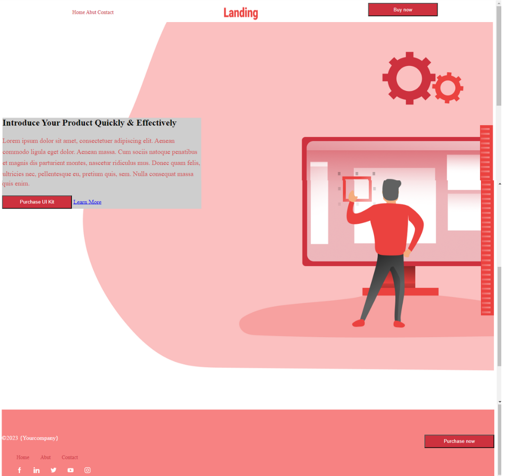

## Landing Page

Vocês fazem parte de um time de desenvolvimento, e estão trabalhando em um projeto e devem realizar a entrega de um website (Landingpage) para um determinado cliente. A primeira entrega não saiu como o planejado e o time de UX/UI criou um [Figma](https://www.figma.com/file/3G8qbstCgvNHkyixIG3V1M/Simple-Landing-Page?type=design&node-id=0-1&mode=design&t=UuDQMhnywYGefPxg-0), para auxiliar o desenvolvimento e realizar uma entrega de maior qualidade para o cliente. 

Sua tarefa é realizar os ajustes e melhorias necessário baseado no Layout disponibilizado, aproveite para realizar refatorações necessário e realizar qualquer correção que precisa ser feita.

##

Este projeto foi feito em grupo (Grupo 3) para a aula de Front End Estático do Bootcamp Vem ser Tech - Front End Ada|Ifood

##

## Como Recebemos o projeto 

## Protótipo de Alta fidelidade

## Como entregamos o projeto

##

Neste projeto utilizamos apenas HTML e CSS.
